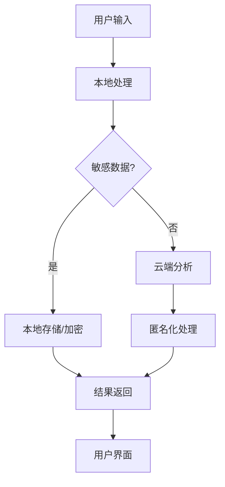

# 💡 [for 新手妈妈] AI 育儿智能中枢 - 从手忙脚乱崩溃边缘到从容自信的育儿专家


## 🌟 项目概述

为新手妈妈打造一个全方位的 AI 育儿智能中枢，通过实时数据分析、个性化建议和情绪支持，帮助妈妈们在育儿的混乱中找到秩序和自信。

### 核心价值主张

- **🌙 睡眠管理革命**：智能睡眠监测，最优唤醒时间，睡眠质量评分，白噪音生成
- **📚 育儿知识图谱**：个性化知识库，实时问题解答，专家级判断，里程碑追踪  
- **⏰ 时间管理优化**：智能日程安排，多任务协调，提醒系统，碎片时间利用
- **😊 情绪健康守护**：情绪识别，及时疏导，社交连接，专家咨询

## 🎯 解决的核心痛点

### 当前育儿痛点
1. **信息过载**：育儿知识分散，难以找到可靠信息
2. **睡眠不足**：婴儿不规律作息导致妈妈严重睡眠缺乏
3. **时间碎片化**：多任务处理效率低下
4. **情绪焦虑**：新手妈妈普遍面临压力和抑郁风险
5. **缺乏专业指导**：及时获得专家建议困难

### 我们的解决方案
- **一站式平台**：整合所有育儿相关功能
- **AI智能推荐**：基于妈妈和宝宝特征的个性化建议
- **实时响应**：24/7 AI陪伴和专业支持
- **数据驱动**：基于科学育儿理论和大数据分析

## 🏗️ 技术架构

### AI能力整合
- **多模态分析**：整合语音、视觉、传感器数据
- **个性化推荐**：基于妈妈和宝宝的独特特征定制方案
- **实时学习**：不断优化算法，适应用户习惯
- **隐私保护**：本地化处理敏感数据，确保安全

### 生态系统
```
┌─────────────────┐    ┌─────────────────┐    ┌─────────────────┐
│   智能设备      │    │   移动应用       │    │   专业服务       │
│  • 可穿戴设备   │◄──►│  • 简洁界面      │◄──►│  • 医生对接     │
│  • 智能摄像头   │    │  • 实时提醒      │    │  • 专家咨询     │
│  • 温度传感器   │    │  • 数据可视化    │    │  • 数据分析     │
└─────────────────┘    └─────────────────┘    └─────────────────┘
         │                       │                       │
         └───────────────────────┼───────────────────────┘
                                ▼
                       ┌─────────────────┐
                       │   AI育儿中枢     │
                       │  • 睡眠管理     │
                       │  • 知识图谱     │
                       │  • 时间调度     │
                       │  • 情绪监测     │
                       └─────────────────┘
```

## 🚀 核心功能模块

### 1. 🌙 智能睡眠管理系统
```typescript
interface SleepMonitor {
  babySleepPattern: SleepCycle;
  motherSleepQuality: number;
  optimalWakeTime: Date;
  sleepScore: number;
  whiteNoiseGenerator: AudioGenerator;
}
```

**功能特性**：
- **智能睡眠监测**：通过可穿戴设备和手机传感器监测婴儿和妈妈的睡眠模式
- **最优唤醒时间**：基于睡眠周期的智能唤醒建议，避免哭闹影响
- **睡眠质量评分**：实时反馈睡眠质量，给出改善建议
- **白噪音生成**：根据婴儿状态自动生成最佳安抚音效

### 2. 📚 育儿知识图谱系统
```typescript
interface KnowledgeBase {
  personalizedContent: PersonalizedContent[];
  realTimeQA: QnAService;
  milestoneTracking: MilestoneTracker;
  expertJudgment: ExpertSystem;
}
```

**功能特性**：
- **个性化知识库**：基于宝宝月龄、健康状况、性格特征的定制化育儿知识
- **实时问题解答**：拍照识别宝宝症状，AI给出专业建议
- **专家级判断**：集成儿科医生建议和育婴专家经验
- **里程碑追踪**：智能跟踪宝宝发育里程碑，及时预警异常

### 3. ⏰ 智能时间管理
```typescript
interface TimeManager {
  smartSchedule: SmartSchedule;
  multiTaskCoordination: TaskScheduler;
  reminderSystem: ReminderSystem;
  fragmentUtilization: TimeOptimizer;
}
```

**功能特性**：
- **智能日程安排**：基于宝宝作息规律，自动安排妈妈的时间表
- **多任务协调**：处理喂奶、换尿布、哄睡、家务等多任务调度
- **提醒系统**：智能提醒重要事项，避免遗漏
- **碎片时间利用**：根据可用时间间隙推荐高效活动

### 4. 😊 情绪健康守护
```typescript
interface EmotionGuardian {
  emotionRecognition: EmotionDetector;
  timelyIntervention: InterventionSystem;
  socialConnection: SocialNetwork;
  expertConsultation: ConsultationService;
}
```

**功能特性**：
- **情绪识别**：通过语音语调和面部表情识别妈妈情绪状态
- **及时疏导**：在压力峰值前介入，提供冥想、呼吸训练指导
- **社交连接**：匹配相似情况的妈妈群体，建立支持网络
- **专家咨询**：一键连接心理咨询师，获得专业帮助

## 🛠️ 技术实现细节

### AI模型选择
- **Claude 3.5**：复杂推理和个性化内容生成
- **GPT-4**：自然语言交互和多轮对话
- **GLM-4**：中文语境下的文化适应性训练
- **本地模型**：隐私敏感任务的本地处理

### 数据安全架构


### 性能优化策略
- **边缘计算**：实时处理本地数据，减少延迟
- **智能缓存**：预加载可能需要的信息
- **异步处理**：后台处理复杂分析任务
- **负载均衡**：根据任务复杂度分配资源

## 📊 商业模式

### 目标市场定位
- **核心用户**：0-3岁婴儿的新手妈妈
- **次要用户**：家庭成员（爸爸、祖辈）
- **B端客户**：母婴产品品牌、医疗机构、保险公司

### 收入模式
```typescript
const revenueStreams = {
  freemium: {
    basicFeatures: "免费",
    premiumFeatures: "订阅制",
    expertConsultation: "按次付费"
  },
  b2b: {
    whiteLabel: "企业定制",
    dataInsights: "数据分析服务",
    apiAccess: "API接口服务"
  },
  partnerships: {
    healthcare: "医疗机构合作",
    retail: "母婴产品合作",
    insurance: "保险公司合作"
  }
}
```

### 定价策略
- **基础版**：免费，包含核心功能
- **高级版**：¥29.9/月，包含AI专家咨询
- **专业版**：¥99.9/月，包含个人专家顾问
- **家庭版**：¥49.9/月，支持多用户

## 🎨 用户体验设计

### 应用界面原型
```
┌─────────────────────────────────────────────────────┐
│  🌙 AI育儿智能中枢              💬 实时帮助        │
├─────────────────────────────────────────────────────┤
│                                                     │
│  今日焦点:                                          │
│  📊 宝宝睡眠质量: 85%                              │
│  ⏰ 下次喂奶: 14:30                                 │
│  📈 发育里程碑: 正常                               │
│                                                     │
│  快速功能:                                          │
│  🔍 症状查询    📋 育儿知识    📅 时间管理        │
│  😊 情绪记录    👥 社区交流    🏥 专家咨询        │
│                                                     │
│  AI助手: "根据宝宝的睡眠模式，建议您在14:15开始    │
│          准备喂奶，这样能获得最佳的睡眠质量。"        │
│                                                     │
└─────────────────────────────────────────────────────┘
```

### 交互设计原则
1. **简洁直观**：新手妈妈也能快速上手
2. **智能引导**：AI主动提供建议，而非被动等待
3. **个性化体验**：基于用户习惯和偏好调整
4. **情感化设计**：温暖的界面和友好的交互

## 🚀 实施路径

### MVP版本 (1-3个月)
- [x] 基础睡眠监测和提醒
- [x] 育儿知识库搜索
- [x] 基本日程管理
- [x] 简单情绪记录

### V1.0版本 (3-6个月)
- [ ] 多模态数据整合
- [ ] AI个性化推荐
- [ ] 社区功能上线
- [ ] 专家咨询系统

### V2.0版本 (6-12个月)
- [ ] 硬件设备集成
- [ ] 家庭共享功能
- [ ] 医疗数据对接
- [ ] 企业解决方案

## 📈 预期效果与影响

### 量化指标
- **用户留存率**：目标 85%+
- **用户满意度**：目标 4.5/5.0
- **睡眠改善**：妈妈睡眠时间增加 25%
- **育儿效率**：时间管理效率提升 40%
- **情绪健康**：焦虑指数降低 30%

### 社会影响
- **降低抑郁风险**：减少产后抑郁发生率
- **推广科学育儿**：普及科学育儿理念
- **家庭和谐**：改善家庭关系和育儿体验
- **医疗压力**：减少不必要的医院就诊

## 🔒 安全与隐私

### 数据安全
- **端到端加密**：所有用户数据加密传输和存储
- **本地处理**：敏感信息在设备本地处理
- **匿名化分析**：数据分析时去除个人身份信息
- **合规认证**：符合医疗健康数据保护法规

### 隐私保护措施
1. **用户控制**：用户完全控制数据分享权限
2. **数据最小化**：只收集必要的信息
3. **透明度**：清晰说明数据使用方式
4. **可撤销**：用户可以随时撤回数据授权

## 🤝 合作与生态

### 技术合作伙伴
- **智能硬件厂商**：小米、华为等IoT设备
- **医疗健康机构**：妇幼保健院、儿科诊所
- **母婴品牌**：知名母婴产品和服务提供商
- **科研机构**：医学院校、育儿研究机构

### 开发生态
- **开源组件**：部分核心算法开源
- **API生态**：提供API接口供第三方开发
- **开发者社区**：吸引育儿科技开发者
- **标准制定**：参与育儿科技行业标准制定

## 📋 开发任务清单

### 前端开发
- [ ] React Native 移动应用开发
- [ ] 响应式界面设计
- [ ] 用户交互优化
- [ ] 多语言支持

### 后端开发  
- [ ] Node.js + Express 服务器架构
- [ ] 数据库设计和优化
- [ ] AI服务集成
- [ ] 推送通知系统

### AI开发
- [ ] 自然语言处理模型训练
- [ ] 计算机视觉图像识别
- [ ] 推荐算法开发
- [ ] 情感分析模型

### 测试与部署
- [ ] 功能测试和性能测试
- [ ] 安全测试和渗透测试
- [ ] 用户验收测试
- [ ] 云服务部署

## 🎯 成功指标

### 用户指标
- 月活跃用户数：100,000+
- 用户留存率：85%+
- 用户满意度：4.5/5.0
- 功能使用率：70%+

### 业务指标
- 订阅转化率：15%+
- 客户获取成本：≤¥100
- 月经常性收入：¥500,000+
- 年增长率：200%+

### 技术指标
- 系统可用性：99.9%+
- 响应时间：<500ms
- AI准确率：90%+
- 数据安全：零泄露事件

## 🚀 Roadmap

### 2026 Q2
- [x] 项目立项和需求分析
- [ ] MVP版本开发
- [ ] 核心功能测试
- [ ] 种子用户招募

### 2026 Q3  
- [ ] V1.0版本发布
- [ ] 市场推广和用户增长
- [ ] 合作伙伴洽谈
- [ ] 数据收集和优化

### 2026 Q4
- [ ] V2.0版本规划
- [ ] 硬件设备集成
- [ ] 企业解决方案开发
- [ ] 国际市场调研

### 2027 Q1
- [ ] 国际版本发布
- [ ] 更多语言支持
- [ ] AI模型升级
- [ ] 新功能开发

---

## 📞 联系我们

- **项目负责人**：AI Ideas团队
- **技术支持**：support@ai-parenting-hub.com
- **商务合作**：business@ai-parenting-hub.com
- **用户反馈**：feedback@ai-parenting-hub.com

## 📄 许可证

本项目采用 MIT 许可证 - 详见 [LICENSE](LICENSE) 文件

---

*最后更新：2026年3月28日*
*版本：v1.0.0*
*状态：开发中*